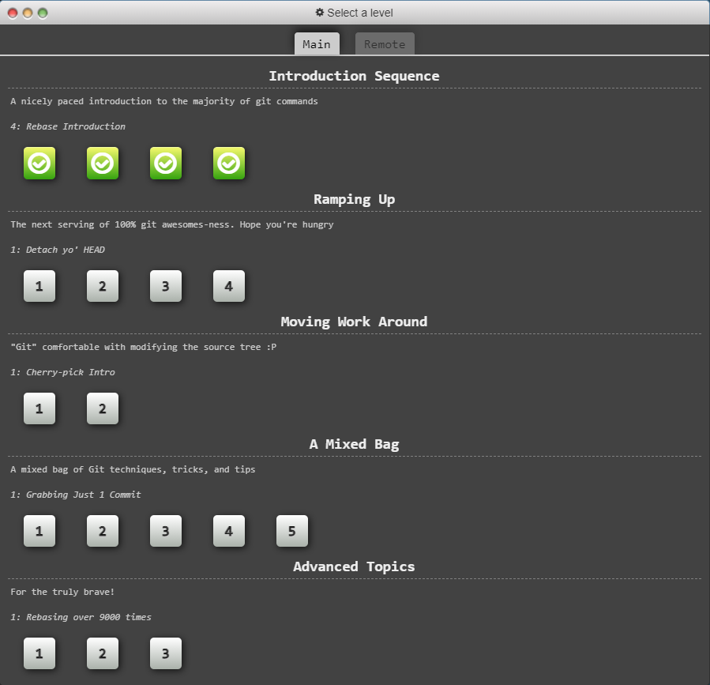

### Part 1
**lab2part1 repo link:**

**gitk and git log:**

### Part 2
**Spoon and Fork reposity link:**

**Git Intro Sequence**

### Part 3
**PullReq Fork link:**

**diff screenshot**

**git tag -l screenshot**

**Common repo link:** 
### 5 - Blocky

### 6 - OSS Idea

An open source software that I feel I could contribute on is Quacs. A feature that I feel would be beneficial would be to enter what requirements one needs to graduate and be able to filter classes that will satisfy those requirements. I could contribute by cloning their github repo and working on commits and pull requests.
